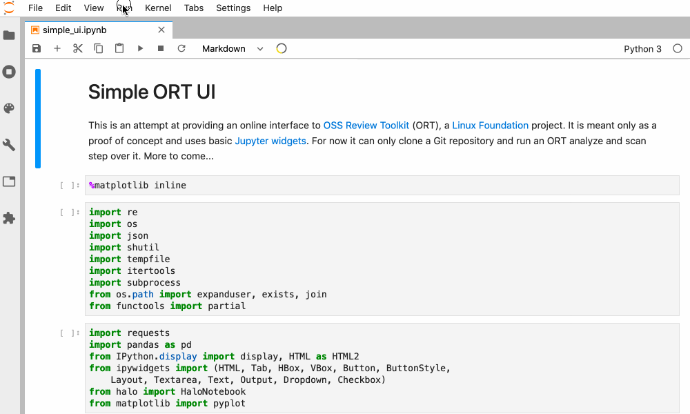

# Ortung

[](https://mybinder.org/v2/gh/deeplook/ortung/master?urlpath=lab) 

This repo can be used as an online interface to the
[OSS Review Toolkit](https://github.com/heremaps/oss-review-toolkit) (ORT).
The name *Ortung* should give a sense of "law and order" as often associated with the German
word "Achtung!" The idea is somewhat inspired by http://ortaas.org, but will hopefully provide
a more fine-grained interface at some time.



## Preliminary Test

```bash
$ ort --version
________ _____________________
\_____  \\______   \__    ___/ the OSS Review Toolkit, version 0.1.0-SNAPSHOT.
 /   |   \|       _/ |    |    Running using Java 11.0.1-internal on Linux with
/    |    \    |   \ |    |    ORT_USER_HOME = /home/jovyan/.ort
\_______  /____|_  / |____|    SHELL = /bin/bash
        \/       \/
More environment variables:
TERM = xterm
JAVA_HOME = /srv/conda/envs/notebook
```

You can run the sample scan on the [mime-types](https://www.npmjs.com/package/mime-types) NPM package mentioned in the ORT 
[Getting Started section](https://github.com/heremaps/oss-review-toolkit/blob/master/docs/getting-started.md)
as follows:

```bash
$ cd ~/tmp
$ bash scan_mime_types.sh
[...]
```

More to come, please stay tuned...
